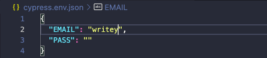
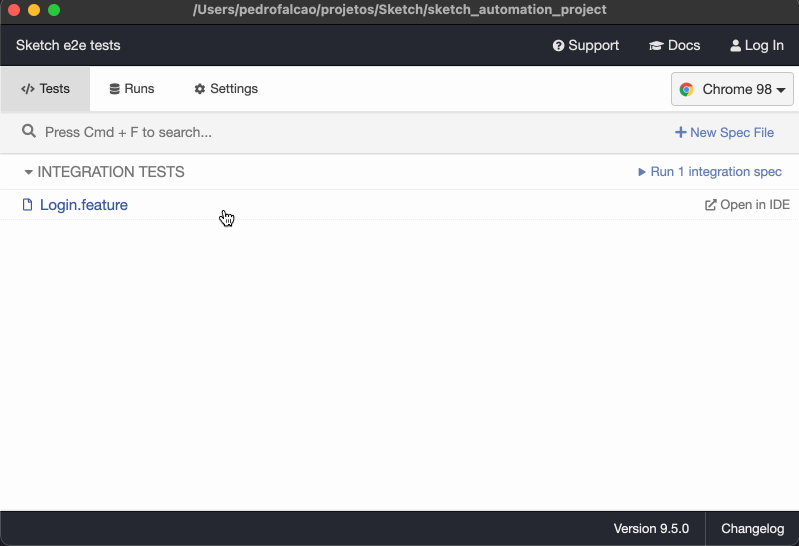
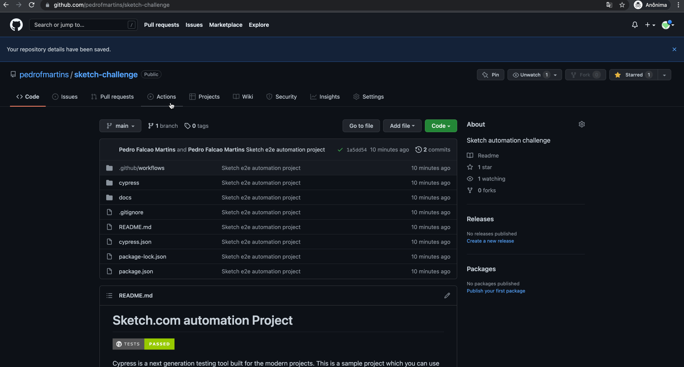
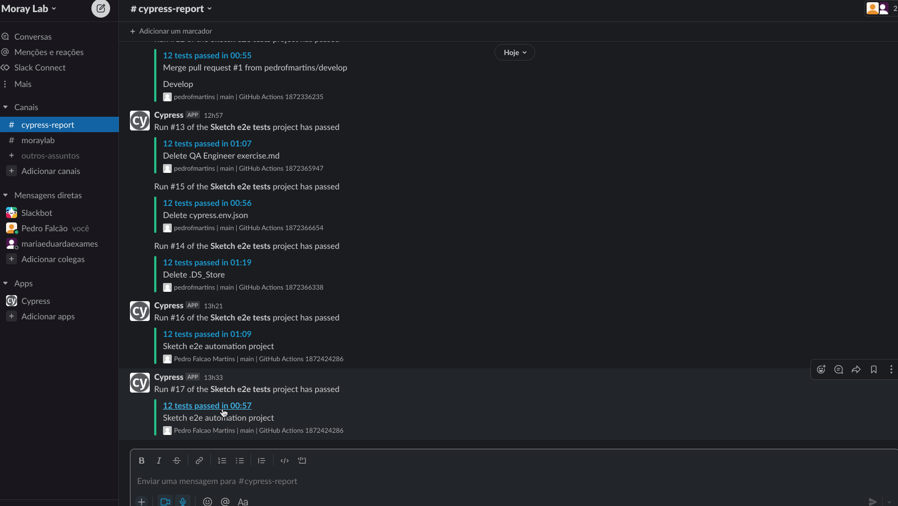

# Sketch.com automation Project
[](https://dashboard.cypress.io/projects/oy76s1/runs)

Cypress is a next generation testing tool built for the modern projects. This is a sample project which you can use to start your E2E testing with Cypress.

## Sketch E2E tests - Scenarios

This project is the automation of the Sign In flow at sketch.com.

### Scenarios:

```
Scenario Outline: Sign In successfull - Using <signin>  to Sign In
  Given I am at the Sign In area
  When I type my email, pass and "<signin>" to sign in
  Then I am redirected to the restricted area

  Examples: 
    | signin  |
    | click   |
    | enter   |


Scenario: Sign Out successfull
  Given I am at the restricted area
  When I click on the Sign Out button
  Then I am redirected to the Sign In area


Scenario: Sign In without email and pass
  Given I am at the Sign In area
  When I click on the Sign In button
  Then I can see the blank email and password error messages


Scenario: Sign In without pass
  Given I am at the Sign In area
  When I type only my email
  Then I can see the blank password error message


Scenario: Sign In without email
  Given I am at the Sign In area
  When I type only my pass
  Then I can see the blank email error message


Scenario Outline: Wrong Sign In - Email Validation with email <email>
    Given I am at the Sign In area
    When I type "<email>" and pass
    Then I can see the "<type>" error message

  Examples: 
    | email             | type      |
    | c@c.c             | inbox     |
    | testing@testing.c | details   |
    | aaaaa             | invalid   |


Scenario Outline: Wrong Sign In - Password Validation with password <pass>
  Given I am at the Sign In area
  When I type my email and "<pass>"
  Then I can see the "<type>" error message

  Examples: 
    | pass | type     |
    | 123  | details  |


Scenario: Sign In - Show my password
  Given I am at the Sign In area
  When I type my credentials
  And I click on the Eye Icon
  Then I can see my password


Scenario: Sign In - Forgot Password
  Given I am at the Sign In area
  When I click on the Forgot Passord? link
  And I type my email
  Then I can see the sent reset email message

```

## Project

## Running locally

### Prerequisites

* NodeJs v17.3.0 installed

### Step-by-step
```
# Clone this repository and change to the project directory:
git clone https://github.com/pedrofmartins/sketch-automation-project.git && cd sketch-challenge

# In order to run locally, you will need to create the cypress.env.file with your credentials:
```

```
# It is also possible to run the tests pipeline, If this is the case you will just need to click on the Run pipeline button :)

# Install the dependencies:
npm install

# If it's the first time you run the project it will take some time for
# the installation to be completed.

# Now cypress is installed and ready to use
#     If you want to see the running you can open the cypress GUI
npx cypress open
#     And select one spec file to run. In our case is the Login.Feature
```




```
#     Or you can run the tests headless with:
npx cypress run --headless
#     You also can choose the browser you want to run with:
npx cypress run --headless --browser chrome
```

## You can see other options at:

[Cypress docs](https://docs.cypress.io/)

#### Just have fun! :)

## Running at Github Actions

```
#     In the Sketch challenge repository, you need to click on "Re-run all jobs" or push a new code into your working branch, and Actions
#     will run  the tests
```



```
#     After Actions run all tests, the results will be at Cypress dashboard
```


```
#     Cypress dashboard has an integration mode with Slack, which is helpful
```



## Project architecture

The implementation follows the Cypress convention:
```
cypress
├── integration     # Feature(s) file(s)
├── puglins         # Plugins configuration file(s)
└── support         # Scenarios Implementation
└── utils           # Mapping of the locators
```
